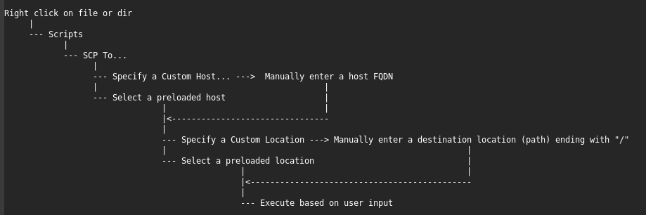

# Nautilus SCP Helper
maintained by @hkdb

## SUMMARY

A Nautilus script designed for and tested on Gnome 3.36 to enable right click action to directly scp a file or directory to a remote host via a little GUI interaction.

## WHY

I am normally doing most of this in a terminal but once in a while, someone will send me something to upload to a server and I will somehow decide to look for the file with Files (nautilus) at which point, I would have to open a terminal at that location to type a scp command. With this nautilus script, I am able to instead just right click on any file or directory, select the script which initiates dialogs to select a remote host and location (path) for me to accomplish the same thing.

## CHANGE LOG

- 12092020 - Added auto add custom input to .scp_hosts and .scp_locations
- 12092020 - initial commit

## DEPENDENCIES

- Gnome
- Nautilus
- SCP
- Zenity

## LIMITATIONS

Currently, this script does not account for custom ssh ports.

## INSTALLATION

1. `git clone https://github.com/hkdb/nautilus-scp.git`
2. `cd nautilus-scp`
3. `./install.sh`

## CONFIGURATIONS

- ~/.scp_hosts | list of often used hosts (FQDN) separated by newlines | WARNING: DO NOT DELETE THE LINE "Specify a Custom Host..."
- ~/.scp_locations | list of often used destination paths separated by newlines | WARNING: DO NOT DELETE THE LINE "Specify a Custom Location..."

## USAGE

Click on the animated GIF above to see it in high-res with YouTube.

## DISCLAIMER

This repo is sponsored by 3DF OSI and is maintained by volunteers. 3DF Limited, 3DF OSI, and its volunteers including the author in no way make any guarantees. Please use at your own risk!

To Learn more, please visit:

https://osi.3df.io

https://3df.io                              
